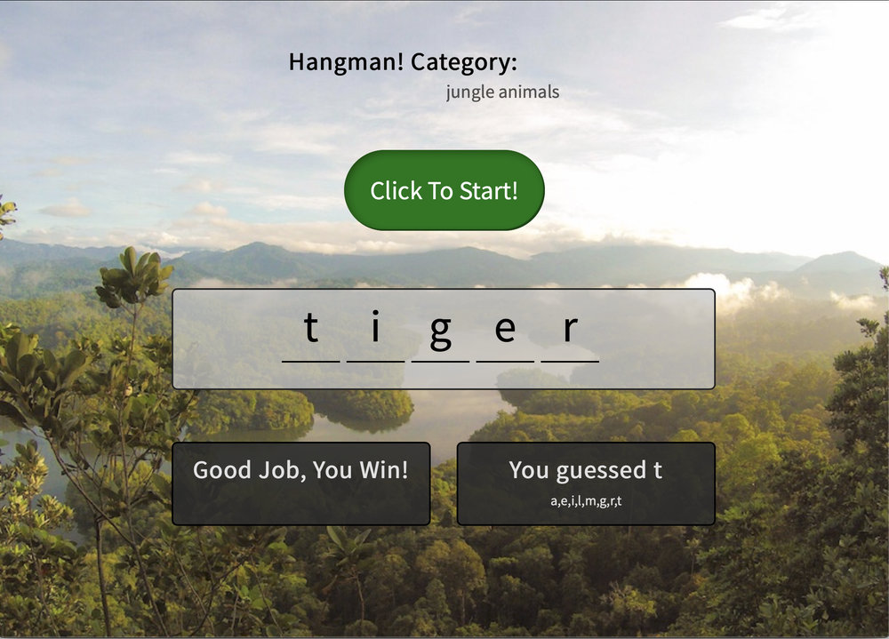

# Hangman Word Game

This project was a fun one with a lot of extra logic to sort through that wasn't necessarily imediatley apparent. A lot of comparing, looking, tracking and randomizing. Many of the visual elements are both generated and filled by java script while by styled by classes. At the end of it all I probably spent more about as much time going back through and styling and then adding some funtion to the style. It may be was to not start with such a scratch pad wire frame on some future projects.

One of the biggest things I'm working on is documenting functions as I go so I don't have to spend the time deciphering which fuction does what and why in context.

